# PlanNUS - DSA3101 AY22/23 Sem 2 Minimising Stress from Course Deadlines (02 Course) 

NUS students are often stressed out due to multiple deadlines or examinations on the same day. The aim of this project is to investigate if it is possible to reduce or alleviate this stress a little, at least at the department level. Currently, module instructors are not aware of the assignment deadlines that are set by one another. This may result in having multiple deadlines on a single day which adds on to the stress levels of students. 

The lack of information being shared between professors mostly results in students having to email their instructors to notify them on certain clashes or stressful weeks at a late notice. This becomes a very reactive and passive process that causes unnecessary trouble for both the instructors and students.
If it is possible to visualize the numerous deadlines over a semester, then it may be possible to suggest to instructors to adjust their deadlines in order to improve the mental-wellbeing of students. 


## Frontend

* Chong Wan Fei
* Jonas Lim Wei Qi
* Koh Long Yang
* Ng Xuan Jun


## Backend

* Chen Sixuan
* Janelle Tay Xin Yi

## Goal:

1. Reduce stress level of students by increasing awareness amongst module instructors on relevant deadlines and stress level of their students before and during the semester. By allowing instructors to have an overview, this would help facilitate coordination between different professors in deconflicting high stress periods that their students might face. 


2. We will also have an optimisation model that will help prompt the instructors to change the dates of specific tasks if their students are experiencing high stress levels on a particular day. We will provide flexibility for instructors to choose which are the least stressful dates that are within their marking timeframe / lesson plan as well.

---

## Stress Levels

The stress scores, $s$ are banded into the following levels:

1. $0 \leq s < 5$ - Good, Green Colour
2. $5 \leq s < 7$ - Moderate, Yellow Colour
3. $7 \leq s \leq 10$ - Stressed, Orange Colour
4. $10 < s$ - Very Stressed, Red Colour


---

## Start up

To get started, 

1. Ensure that you have docker installed and have opened up docker

2. Clone this repository

`git clone "https://github.com/xuan-jun/dsa3101-2220-02-course.git"`

3. You can run the following command in the root directory

`docker compose up -d`

4. You should have 3 containers up and running:
   1. `flask_container` - This will contain the flask api that connects the database and the react website. (Served on port 4000)
   2. `mssqldb_container` - This will contain the database with the necessary information about the instructors and assignments (Served on port 1433)
   3. `react-frontend` - This will be hosting our react frontend website (Served on port 3000)

5. Go to `http://localhost:3000` and you should be able to see the website
---
## Pages

| Page | Purpose |
|------|---------|
|Landing| Allows user to select between instructor or student|
|Student Calendar| Allows Students to check out assignment distribution for modules in different semesters|
|Login|Allows for Instructors to login|
|Instructor Calendar| Allows for instructors to look at the relative stress level of their students across the semester for the modules they are teaching|
|Instructor Assignment| Allows for Instructors to Add, Edit, Delete assignments while allow them to optimise for the best dates|


---

## Landing Page

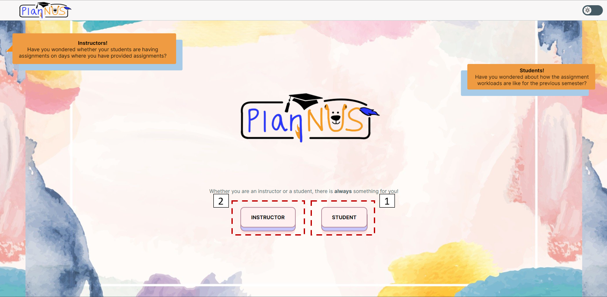

In the landing page you will have 2 options to choose from:

1. Instructor - Directs you to the instructor's login page
2. Student - Directs you to the student calendar page

---

## Student Calendar Page

The student's calendar page is aimed to do the following things:

1. Provide students with an avenue to look at the assignment workload for previous semesters so that they can see the relative assignment distribution across the semester. This is something that students are currently unable to do and we found to be helpful
2. They could potentially estimate the type of assignments they can receive given the same instructor and they can plan for modules better

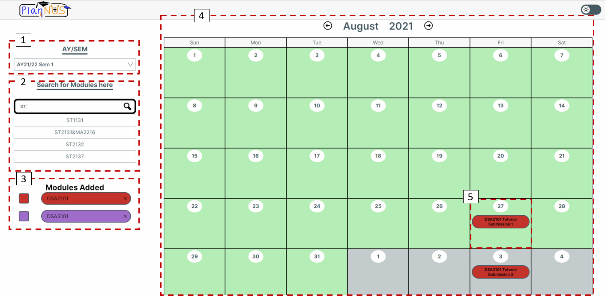

In the Student's Calendar Page, you have a few things that you can do

1. Select the AY/SEM that you are concerned with
   * Note to select the AY/SEM first before searching for modules
2. Search for the modules that you want to view
   * Note that we currently only have data for ST/DSA modules
3. This will be a list of the modules that you have selected. You can click on the square on the left to switch colours for modules if there are other colours that are more appealing to you. You can also remove the modules by clicking on the cross
4. You can navigate through different months to see which days have assignments using the left and right arrows
5. You can click into individual cells to find out more details about the assignments on that day. Each of the colours will indicate a different level of stress.
    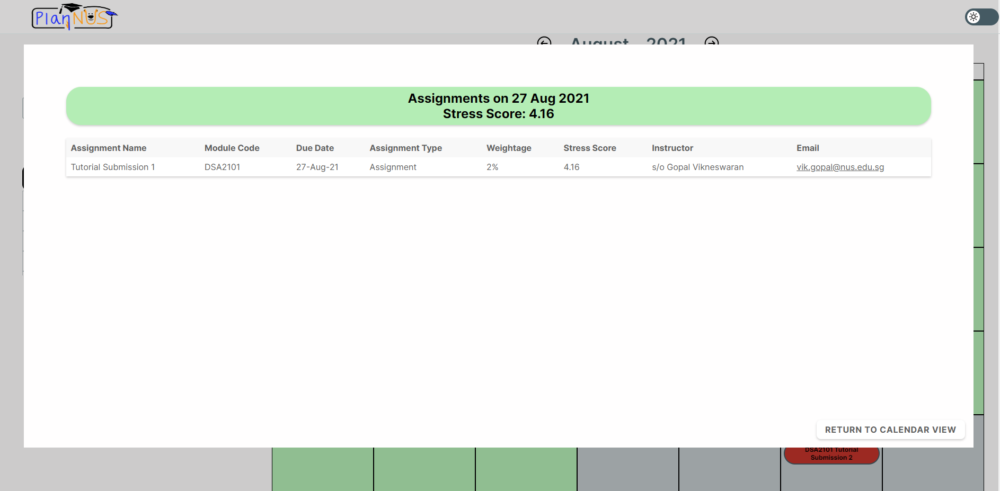
   *  If you were to click into any of the cells, you can see more details about the assignments that were given that day and the overall stress score

   1. Assignment Name
   2. Module Code
   3. Due Date
   4.  Assignment Type
   5.  Weightage
   6.  Stress Score
   7.  Instructor Name
   8.  Instructor Email


---

## Login Page

Once you click on Instructor, you will be redirected to the login page. The verification process is only required for Instructors as we want to confirm what are the modules they are teaching

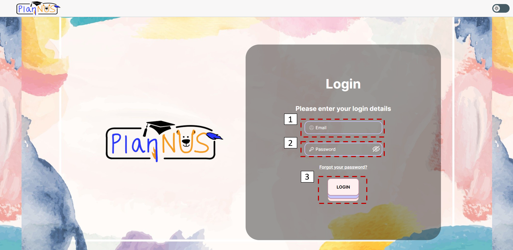

To Login:

1. Type in your email (NUS Email for the instructor)
2. Type in your password (Currently: password1 for all users)
3. Click on Login or press 'Enter'

To find out the various instructors that you can access:

You can run the following commands in the `mssql-container`

```
/opt/mssql-tools/bin/sqlcmd -S localhost -U SA -P 'Pass123!'
```

```sql
USE CoursesDB;
GO;
SELECT * FROM Login;
GO;
```

---

## Instructor Calendar Page

Once we login to the page, you will be greeted by the following page

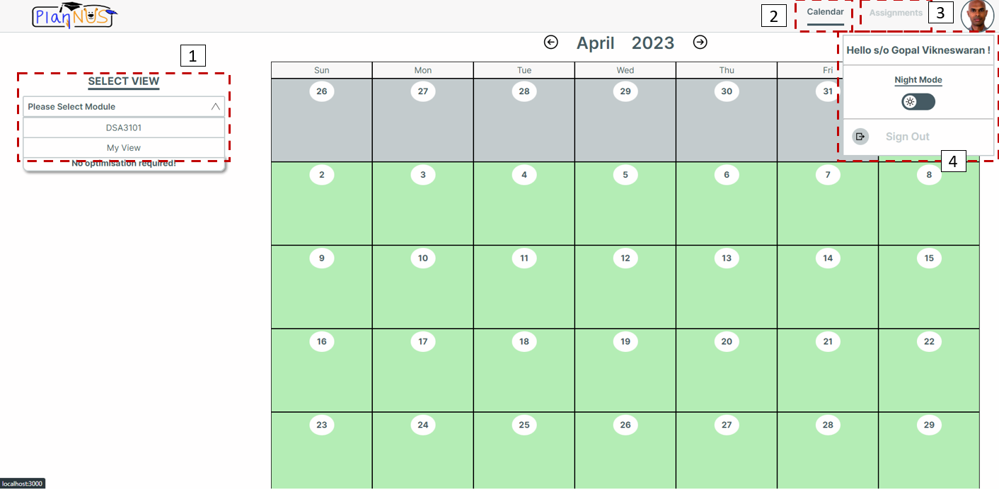

You will be able to see and do the following things:

1. You can click on this toggle to view the modules that you are teaching as well as a My View Page
   * My View Page
    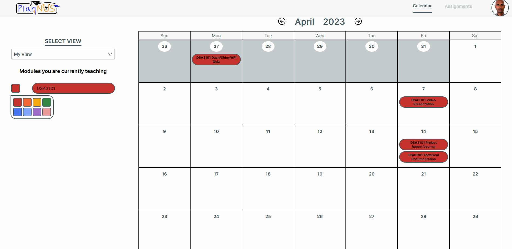
      * My View is aimed at allowing instructors to view all the assignments for the modules they are teaching. This is to allow for them to better plan across modules
      * Clicking into each cell will show a detailed view of the list of assignments on that day

2. Navigation bar link to the Calendar Page which is the default page
3. Assignment bar link to the Assignment Page
4. When you hover over your profile picture, you will have the option to switch to *Night Mode* and also sign out if you want to.

### Instructor Calendar - After selecting module

Once you have selected a module, you will be able to see an updated version of the Calendar

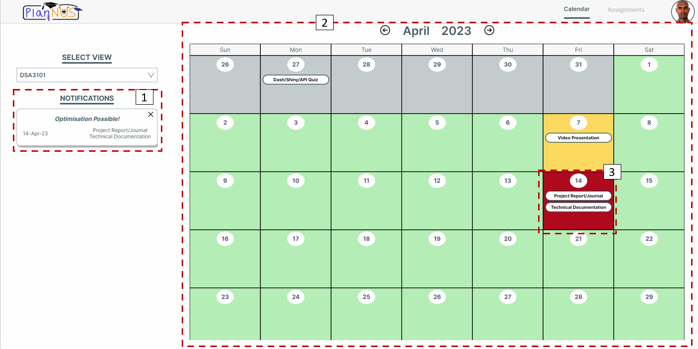

You will be able to do the following things:

1. This is a notification corner to tell you the days whereby you can optimise your assignment dates. This will be alerted when the days have a stress score of above 10 (indicated with a red cell). You can click on it which will give you a detailed view of the assignments on that day

2. You can navigate through the various months to see the relative stress distribution of your students across the months.

3. You can click into individual cells to get the detailed view of the individual days


### Instructor Calendar - Clicking into specific days / notification

When you click into any individual cells or the notification, you will see the following page. The purpose of this is to allow for instructors to either edit their own assignment if they feel like it is too stressful or they can contact the other instructor to work something out.

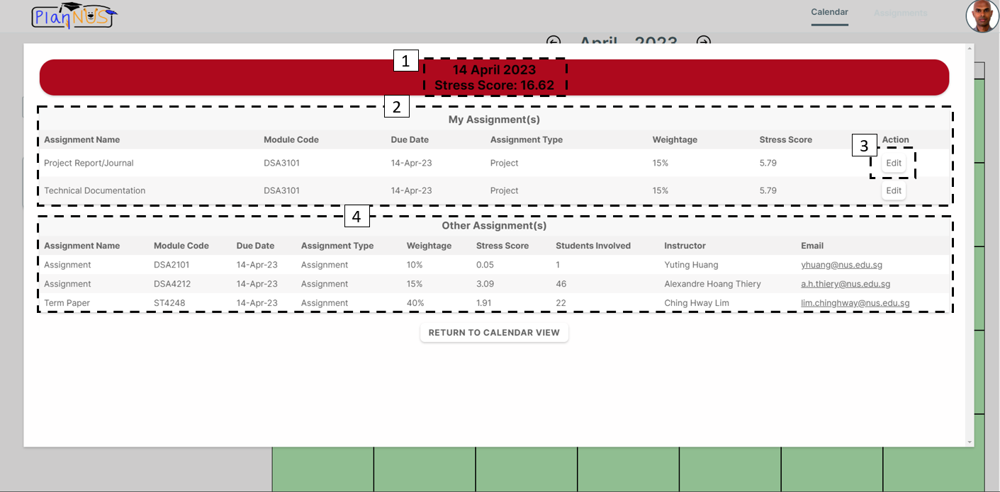

You will be able to see / do the following:

1. See the current date, the current stress score (cumulative sum of all the stress scores for the day) for the day and the relative colour for the day

2. You can see a list of the assignments that you have assigned on that day with the following details:
    * Assignment Name
    * Assignment Type
    * Weightage
    * Stress Score associated with that assignment

3. If you feel like you want to change the deadline for that assignment, you can click on the *Edit* button and it will redirect you to the Assignment Page where you can edit the assignment

4. You can see a list of the other assignments that at least 1 of your students have to take as well.
    * The stress score for those assignments are computed by taking the relative proportion of students $\frac{\text{Students Taking Both}}{\text{Number of Students in your module}} \times \text{Stress Score for that assignment}$
    * You will be able to see the following information for those assignments as well:
      * Assignment Name
      * Module Code
      * Due Date
      * Assignment Type
      * Weightage
      * Aggregated Stress Score 
      * Number of your students affected
      * Name of other instructor teaching that module
      * Email of other instructor teaching that module

---

## Assignment Page

This page is to allow for instructors to have a better overview of the assignments they have given out. They can also Add, Edit and Delete assignments. We will also provide them with a visualisation of the stress scores if they were to shift the assignments.

When you go to the assignment page, you will be greeted with the following page:

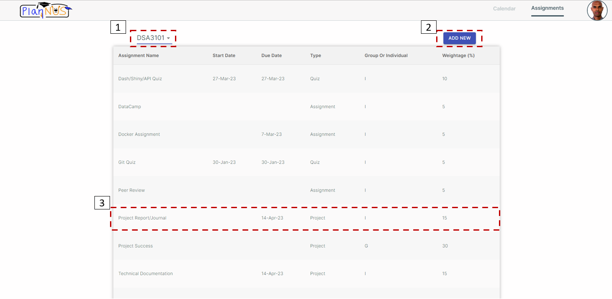

You will be able to do the following things:

1. Select the module that you want to view the assignments

2. Add a new assignment for the current module

3. You can click into any of the assignments to edit or delete it.

### Assignment Page - Add New Assignments

When you click on the *Add New* button, we will be directed to the following page:

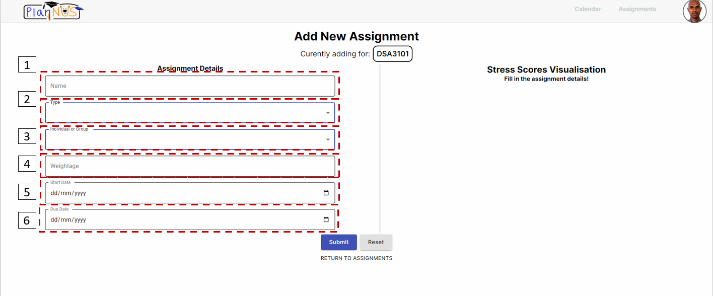

When you come to this page, you will need to fill in the following details:

1. Name of the assignment
2. Type of assignment
3. Whether the assignment is individual or group
4. Weightage of the assignment
5. Start Date of the assignment
6. Due Date of the assignment

**After filling in the details**

Once you have filled in all the details, a visualisation of the stress scores will be displayed on the right. It will display the stress scores of each day if you were to put your assignment on any of those days. We will display -5 / +7 days from the current due date as we do not want to stretch it too far forward or backwards.

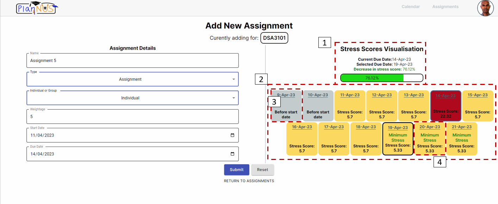

You will be able to see / do the following things:

1. This is a stress score bar that will tell you what is the current due date and what is the selected due date you want to compare with. When you select another due date, you will be able to see the % increase or decrease if you were to change to another due date.

2. You can click on any of the other tiles and the stress score bar will change accordingly.

3. If the date that we are considering is earlier than the start date, we will not conisder them

4. If the tiles state *Minimum Stress*, it means that those dates are the dates with the minimum stress across that window of values. You can then change your due date to further find the most optimal due date


**Changing the due date**

Suppose we change it to 19 Apr 2023

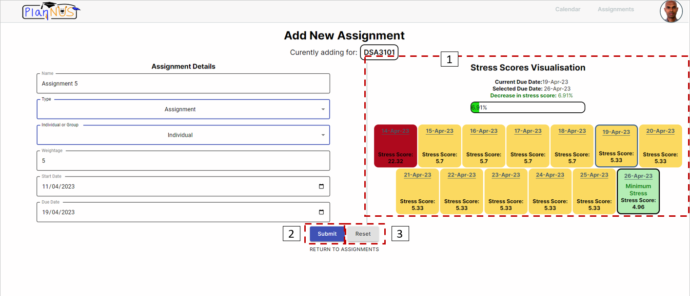

We can see that there is yet another date that is a local minimum. However, we want to provide instructors with the flexibility to choose the best date that they think would be feasible as there are many other considerations that they can have. For instance, they have to mark by a certain period or an assignment can only be given out after some period and needs to be given out before others. Therefore, they can use this to further enhance their planning rather than to have it dictate when they should change an assignment

You can do the following:

1. You can continue to try and find the local minimum

2. You can also click on *Submit* to add the assignment

3. You can also click on *Reset* to reset the whole form if you want to redo.


### Assignment Page - Edit Assignments

Once you click on any assignments, you will be redirected to this page

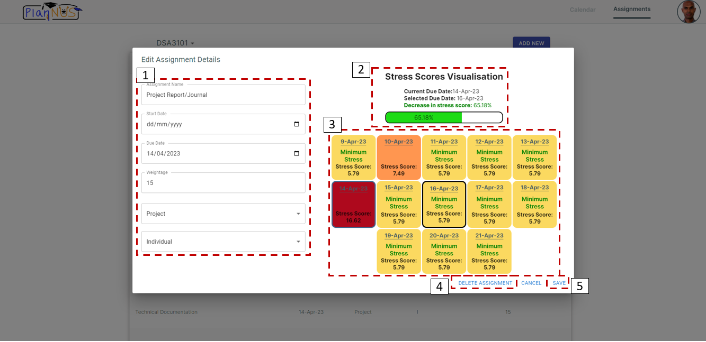

You can do the following in this page: 

1. Change any of the existing details of the current assignment

2. Check out the stress score bar if you were to select other due dates that are within (-5 / +7). Same procedure as when you add assignment

3. You can click on any of the tiles to find out the increase / decrease in stress score with respect to the currently selected due date. You can continue to change the current due date to find the local optimal or just a date that works for you and has acceptable stres score

4. You can click on *Delete Assignment* to delete the assignment if you desire

5. You can click on *Save* if you are ready to save the changes that you have made

---

Have fun planning with PlanNUS!